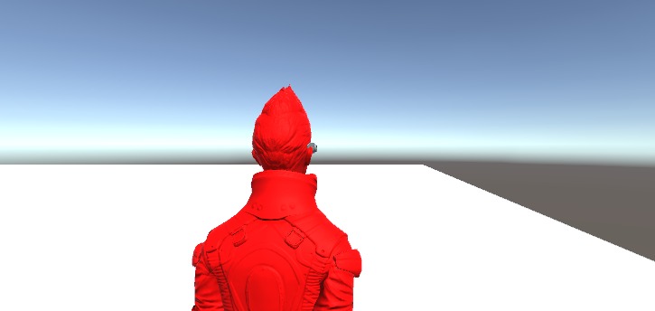
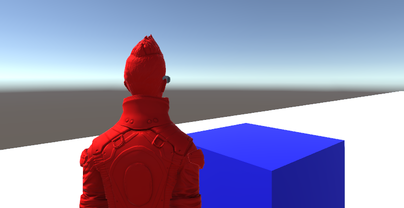

# Practica1_FDV

En esta práctica se ha utilizado los Standard Assets y un cubo del Unity

Lo primero que se hace al iniciar es cambiar el color del personaje a Rojo, utilizando el script cambiarColor

Luego, utilizando un ThirdPersonController, si nos acercamos al cubo y lo tocamos este cambia a azul, utilizando el script cambiarColorCubo

